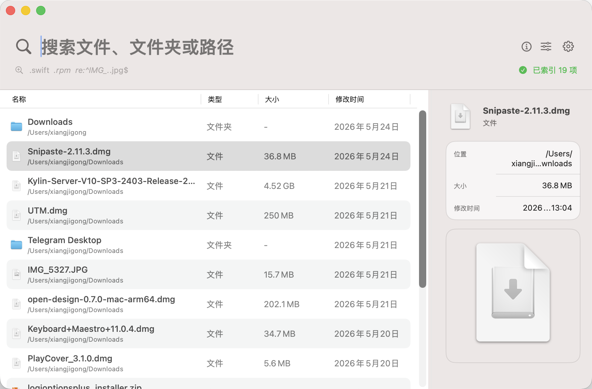
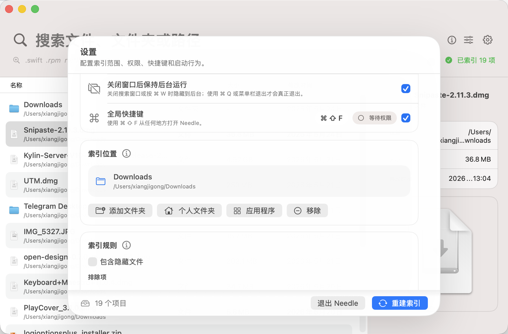

# Needle

Needle 是一款为 macOS 设计的原生文件搜索工具。它面向每天需要频繁定位文件、资料、项目目录、设计素材和工作文档的用户，提供快速、稳定、低打扰的文件名搜索体验。

Needle 不依赖 Spotlight 作为主搜索引擎，而是在本机建立独立文件名索引。索引数据保存在本地 SQLite 中，搜索时加载到内存进行匹配和排序；文件系统变化通过 FSEvents 增量更新。它更适合“我知道文件大概叫什么，需要立刻找到它”的高频文件管理场景。

它不是一个试图接管 Finder 的文件管理器，也不是内容全文检索工具。Needle 的目标更明确：让 macOS 用户用尽可能少的动作，快速找到正确的文件，并以符合 macOS 习惯的方式打开、预览、定位和复制它。

## 界面预览





## 为什么选择 Needle

- **独立索引**：不把 Spotlight 当作主搜索源，索引范围、排除规则和更新节奏都由 Needle 自己控制。
- **输入即搜**：面向文件名、路径、扩展名、通配符和正则搜索，适合快速缩小结果。
- **macOS 原生体验**：Swift / SwiftUI 构建，支持 Quick Look、Finder 定位、打开方式、拖拽和右键菜单。
- **中文优先**：默认中文界面，权限引导、设置说明和交互文案都围绕中文用户组织。
- **低打扰后台运行**：窗口关闭后仍可保留快速唤起能力，并在后台释放前台重资源。
- **本地隐私边界**：索引、搜索词和文件路径保存在本机，不上传到远端服务。

## 适合的使用场景

- 在大量工作文档中快速找到合同、报告、配置文件或归档资料。
- 在开发目录中定位源码、构建产物、日志、脚本和项目文件。
- 在同步盘、外接盘或个人目录中查找已知文件名的一部分。
- 用扩展名、通配符或正则快速筛选 `.pdf`、`.swift`、`*.rpm`、`IMG_*.jpg` 等文件。
- 通过右侧详情和文本预览快速确认文件内容，再决定打开、复制路径或在 Finder 中定位。

## 功能概览

| 能力 | 说明 |
| --- | --- |
| 文件名搜索 | 支持普通关键词、多关键词、扩展名、通配符和正则 |
| 路径搜索 | 可在设置中启用完整路径匹配，适合定位目录层级 |
| 类型筛选 | 支持全部、文件、文件夹筛选 |
| 排序 | 支持名称、类型、大小、修改时间等常用排序 |
| 增量更新 | 通过 FSEvents 监听新建、删除、移动和重命名 |
| 快速预览 | 支持 Quick Look 和小型文本文件的可复制预览 |
| 文件操作 | 支持打开、打开方式、Finder 中显示、复制路径、复制名称和拖拽 |
| 设置管理 | 支持索引位置、排除规则、隐藏文件、路径匹配、登录启动、全局快捷键和后台行为 |
| 更新检查 | 可在设置中检查 GitHub Release，并在主界面以低打扰方式提示 |

## 搜索语法

Needle 默认会匹配文件名，也可以在设置或筛选中启用路径匹配。

常用输入示例：

```text
report
项目 文档
.swift
*.rpm
README*
re:^IMG_.*\.jpg$
ext:pdf 合同
```

说明：

- `.swift` 会按扩展名搜索 Swift 文件。
- `*.rpm`、`README*` 这类输入会作为通配符匹配。
- `re:` 前缀表示正则搜索，正则无效时界面会给出提示。
- 多个普通关键词会同时匹配，适合逐步缩小结果范围。

## 快速开始

1. 下载并打开 `Needle.dmg`。
2. 将 `Needle.app` 拖入“应用程序”文件夹。
3. 打开 Needle，进入设置页添加要索引的位置。
4. 如需搜索受保护目录，在系统设置中为 Needle 授予“完全磁盘访问”。
5. 执行一次重建索引，之后新增、删除、移动和重命名会自动增量更新。

建议先添加常用工作目录，确认结果质量和性能后，再扩大到用户目录、同步盘或外接磁盘。

如果要搜索桌面、文稿、下载、照片图库、部分应用数据等受保护目录，需要在 macOS 系统设置中为 Needle 授予“完全磁盘访问”权限。推荐方式是在系统设置的权限列表中点击 `+`，选择 `/Applications/Needle.app`。

全局快捷键默认是 `Command-Shift-F`。启用全局快捷键需要辅助功能权限，授权后可以在任何应用中快速唤起 Needle。

## 权限说明

Needle 只在必要时引导你授予权限：

- **完全磁盘访问**：用于读取你选择索引范围内的受保护目录，例如桌面、文稿、下载、照片图库和部分应用数据目录。
- **辅助功能**：用于监听全局快捷键，不用于读取屏幕内容或控制其他应用。
- **登录启动**：仅在你手动开启后启用，用于保持后台快速唤起能力。

如果只索引普通目录，Needle 可以在更少权限下运行。权限状态可以在设置页查看。

## 隐私与数据

Needle 的索引数据保存在本机，不上传文件名、路径或搜索内容。应用只索引你在设置中添加的位置，并会按排除规则跳过缓存、依赖目录和低价值噪声目录。

完全磁盘访问只用于读取你选择索引范围内的受保护目录；辅助功能权限只用于全局快捷键监听。Needle 不提供云同步、远程索引或后台上传能力。

## 发布状态

Needle 已具备日常使用所需的核心能力：独立索引、快速搜索、增量更新、权限引导、全局快捷键、后台运行、文本预览、更新检查和 DMG 打包。

当前项目仍保持快速迭代，后续重点会继续围绕大规模索引性能、Developer ID 正式签名发行、异常索引恢复、更多查询语法和更完整的自动化 QA 打磨。

## 构建与测试

```sh
swift build
swift test
swift run NeedleCoreCheck
swift run Needle
```

`NeedleCoreCheck` 是轻量烟雾测试入口，用于验证查询解析、排序、排除规则和 SQLite 持久化。`swift test` 会运行完整 XCTest 测试套件。

## 本地安装

```sh
scripts/package_app.sh debug --install
open /Applications/Needle.app
```

打包脚本会构建 SwiftPM 可执行文件，组装标准 macOS `.app` Bundle，写入 `Info.plist`，复制应用图标，并对本地构建执行签名。测试完全磁盘访问、辅助功能权限、登录启动或全局快捷键时，建议使用 `/Applications/Needle.app`。

## 生成 DMG

```sh
scripts/create_dmg.sh release
open dist/Needle.dmg
```

Developer ID 签名：

```sh
export NEEDLE_SIGN_IDENTITY="Developer ID Application: Your Name (TEAMID)"
scripts/create_dmg.sh release
```

Apple notarization：

```sh
export NEEDLE_NOTARY_APPLE_ID="you@example.com"
export NEEDLE_NOTARY_TEAM_ID="TEAMID"
export NEEDLE_NOTARY_PASSWORD="app-specific-password"
scripts/notarize_dmg.sh dist/Needle.dmg
```

## 设计原则

Needle 不是把 Windows 工具直接搬到 macOS，而是把极速文件名搜索放进更符合 macOS 的工作流：

- 主窗口保持 Spotlight 式轻量心智，输入即搜。
- 结果列表优先支持键盘操作，也保留完整右键菜单。
- 详情栏服务于快速确认文件，而不是替代 Finder。
- 设置采用覆盖式面板，减少独立窗口管理负担。
- 视觉上保持低噪声、清晰层级和原生质感。

产品进度记录在 [PROGRESS.md](PROGRESS.md)，发布检查清单记录在 [docs/QA_CHECKLIST.md](docs/QA_CHECKLIST.md)，更新记录见 [CHANGELOG.md](CHANGELOG.md)。

## 许可证

Needle 使用 [GNU Affero General Public License v3.0](LICENSE) 开源。
